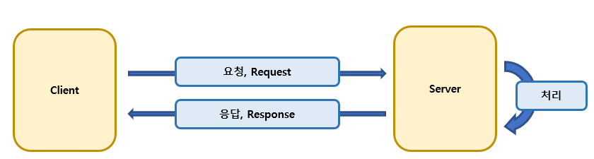
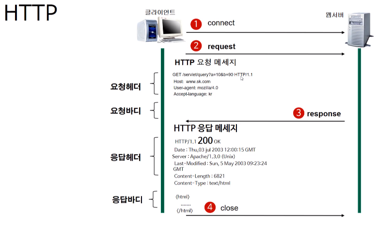
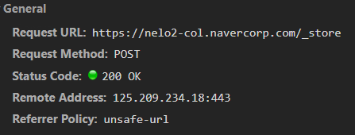
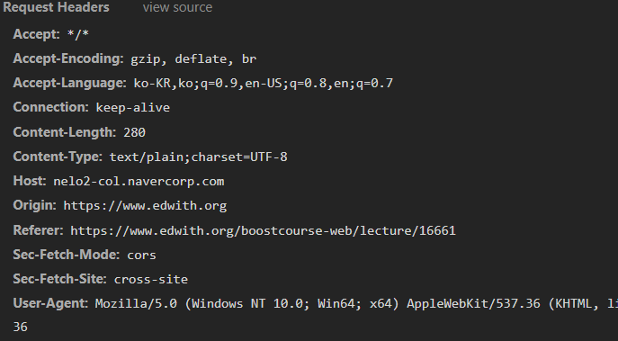

해당 게시물은 [ 부스트코스 ] - 웹프로그래밍 강의(웹의 동작) 를 기반으로 합니다. 

### Summary
 - HTTP란 무엇인가?
 - URL이란 무엇인가?
 - HTTP의 작동과정

### What is HTTP 
웹상에서 server - client 구조로 구성되어 있으며, 서로 데이터를 주고 받는데 사용되는 프로토콜을 의미합니다. 
현재 우리가 사용하는 http는 다양한 버전이 존재하지만, 우리가 주로 사용하는 버전은 http 1.1 버전을 의미합니다.
http 통신으로 문자 형태만이 아닌 다양한 포켓의 데이터를 주고 받을 수 있어, 웹을 이용하는데 있어 확장성을 지녔습니다.
또한 http는 TCP/IP 프로토콜 위의 APP level에서 사용되는 프로토콜며, 기존 TCP/IP의 개념 및 기능이 사용이 가능하나, TCP/IP http 사용 시 차이점이 존재하며 이는 아래에서 정리 할 예정이다.

### HTTP의 특징
 - client 측에서, server 측으로 먼저 요청(request)을 보냄

서버는 해당 요청이 들어오길 기다리는 상태이며, client가 Request을 보내야 서로 통신을 하기 시작합니다.

 - stateless(무상태)의 특징을 지님

무상태란 http 프로토콜을 따른 요청(Request)을 받았을 경우, 해당 요청을 처리한 후에 해당 TCP/IP은 닫히게 된다.

위와 같은 형태는 장/단점이 존재합니다.

#### PROS
 - 지속적인 연결을 유지하지 않기 때문에, 다중 client에 서비스를 지원이 가능.
 
이는 TCP/IP의 연결 지향적인 특징과 반하지만 적은 자원으로 많은 client을 처리 할 수 있습니다. 

#### CONS
 - response 후, 연결이 종료됨으로 이전의 값을 알 수 없음. 

HTTP 요청이 들어올 때, server는 client의 방문 여부를 알 수 없습니다.

이러한 기능을 Cookie가 대행하며 자세한 내용은 차후에 정리 할 예정입니다.

### URL, [Uniform Resource Lacator]
인터넷 상의 자원의 위치 및 경로을 나타내는 방식입니다.

client에서는 server의 구조를 알지 못하더라도, 해당 URL을 통해 원하는 데이터를 받을 수 있습니다.

 
#### URL 구조 
 - 접근 프로토콜 ( http/https )
 - IP 주소 또는 도메인 주소 ( 8.8.8.8/ google.com )
 - 기타 경로 (자원에 대한 상세 주소)( .../posts/13 )

 ex) https:// (접근 프로토콜) www.edwith.org(도메인) /boostcourse-web/lecture/16661(기타경로)
 와 같이 분리가 가능해짐

### HTTP 구조
HTTP의 동작과정에 대해 알아보기전에 HTTP는 어떠한 형태로 구조로 이루어져있는지 먼저 알아보려 합니다.

HTTP는 요청(Request)을 보내면, 서버에서 해당 요청을 처리한 후, Client에게 응답(Response)을 보내는 형태입니다.

요청과 응답을 할, 각각은 헤더(Header)와 바디(body)을 지닙니다

 - 헤더 (Header)
해당 정보는 누가 (client 정보), 어디에(server 정보), 어떻게(http method)등의 정보를 담고 있습니다.

    \+ 요청 헤더 : 요청 메서드, URL, HTTP 버전이 기본으로 들어감

    \+ 응답 헤더 : HTTP 버전, 응답 코드, 설명

    \+ 위에 특정 기본적인 데이터 이외에는 Key-value 형태로 존재

 - 바디 (Body)
서버나, 클라이언트가 보내고자 하는 실질적 데이터(html, text, image...등)가 바디에 담기게 됩니다.

#### request method
다양한 메서드가 존재하나, 많이 사용되는 4가지를 메서드가 있습니다.

1. GET 		: 해당 URL의 정보를 얻어오기 위해서 사용 (Select)
2. POST 	: 특정 데이터를 서버에 보내기 위해 사용 (Insert)
3. PUT		: 서버에 존재하는 데이터를 업데이트하기 위해서 사용 (Update)
4. Delete 	: 서버에 존재하는 데이터를 삭제하기 위해서 사용 (Delete)

\+ 이 4가지가 많이 사용되는 이유는 Restful API에 사용되며, 이는 차후에 정리 예정

### HTTP 동작 과정

1. 서버와 TCP/IP을 연결을 합니다.
2. 요청을 보냅니다.
3. 응답을 보냅니다.
4. TCP/IP 연결을 종료합니다.

매우 간단한 과정을 통해서 처리가 되며, 이 과정을 반복하며 서버와 클라이언트는 통신을 반복하게 됩니다.

아래의 사진은 https://www.edwith.org/boostcourse-web/lecture/16661 로 보내지는 요청 중 하나의 http통신입니다.

해당 http 정보는 크롬의 개발자 도구를 통해서 얻었으며, 기존의 알던 http와 다른 형태로 저장되어 있으나, 포함한 내용은 동일한 것을 볼 수 있습니다.

### 생각해보기 : HTTPS
HTTPS, 웹에서 데이터를 주고 받는 과정에서 제 3자가 데이터 전송 중 가로채 데이터를 조작 및 확인하는 것을 방지하기 위해서 발전된 형태입니다.

이를 위해서 HTTP통신 이외에 추가적인 과정이 추가됩니다.
 
 - 공개키/개인키를 이용한 암호화 과정
 - 연결 이전에 공개키를 받아내는 과정

자세한 내용은 차후 포스트에서 다를 예정입니다.

### 참조

#### image
 - boostCourse-2 : [[부스트코스] 웹 프로그래밍](https://www.edwith.org/boostcourse-web/lecture/16661)

해당 게시물은 [ 부스트코스 ] - 웹프로그래밍 강의( 웹의 동작 (HTTP 프로토콜 이해) )를 기반으로 하얐습니다. 
더 자세한 내용에 대해서 알고 싶으시다면, 아래에 안내되는 페이지에서 확인할 수 있습니다.

부스트코스 메인 페이지 :  https://www.edwith.org/boostcourse-web
이번 포스트와 관련된 페이지 :  https://www.edwith.org/boostcourse-web/lecture/16661/
 

