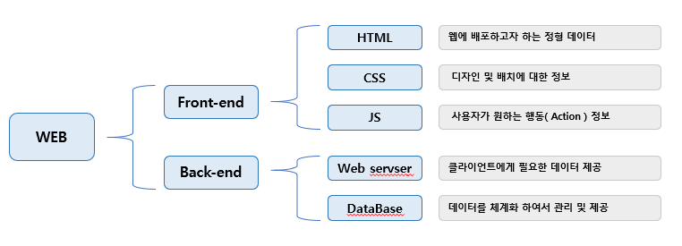

해당 게시물은 [부스트코스] - 웹프로그래밍 [강의](웹 Front-End 와 웹 Back-End) 를 기반으로 합니다. 

### Summary
 - front-end 란?
 - back-end 란?
 - 다양한 프레임워크

이번 글에서는 간략한 Web에서의 기능적 분류인 프론트엔드와 백엔드에 대해서 정리하고자 합니다.

### Front-end란 
 
 프론트 엔드란, 실제 웹 사용자들이 이용하는 브라우저 상에서 UI 또는 여러 기능에 대한 영역입니다.
초기에 아무런 구분없이 하나의 HTML에 모든 데이터가 들어가던 것과 달리 최근에는 그 복잡성이 매우 증가하였습니다.
그 과정에 따라 프론트엔드에서도 영역이 구분이 됩니다.

 - HTML (HyperText Markup Language)

    웹으로 배포하고자 하는 Tree 형태의 정형적 정보, 구조적인 의미를 나타내는 것뿐만이 아니라 링크, 인용, 등으로
    하나의 구조적 문서를 만들어 제공

 - CSS (Cascading Style Sheets)

    HTML의 배치 및 디자인 Render을 위한 정보, 최근에는 에니메이션 및 다양한 효과 또한 제공

 - JS (JavaSrcipt) 

    웹상에의 행위 ( Action )에 대한 정보에 대해 기술, 브라우저상에서 프로그램을 구성하기 위해서 사용

해당 정보를 작성하는 방법은 다양 하나 대부분 각 정보의 영역에 따라 구분하여 저장하게 됩니다.


### Back-end 란
 프론트엔드가 클라이언트를 위한 영역이었다면, 백엔트란 이외에 서버를 위한 영역이라고 할 수 있습니다.
백엔드의 프로그램들은 클라이언트가 원하는 데이터 및 페이지에 접근하기 위한 기능( 정보제공 및 인증...)을 제공하며
이를 직접 또는 간접적으로 연결되어 각자의 기능을 수행하게 됩니다.

예로는
 - WEB server
    클라이언트에게 필요한 데이터를 제공하는 서버

 - DataBase
    데이터를 체계화해 통합 관리하는 서버
 
 이외에 더 다양한 기능을 지원하는 서버들을 백엔드 영역에서 다루게 됩니다.


#### 프론트 엔드 & 백 엔드 개발자가 알아야 할 것들
 - 프로그래밍 언어(JAVA,  Python, PHP, Javascript 등)
 - 웹의 동작 원리
 - 알고리즘(algorithm), 자료구조 등 프로그래밍 기반 지식
 - 운영체제, 네트워크 등에 대한 이해
 - 프레임워크에 대한 이해(예: Spring)
 - DBMS에 대한 이해와 사용방법(예: MySQL, Oracle 등)



### 프레임워크
```
라이브러리와 프레임워크의 차이
 - 라이브러리 : 재사용 가능한 코드들의 집합
 - 프레임워크 : 프로그램 제어 흐름의 주도성이 프레임워크에 존재

즉, 의존성 주입(Deoendecy Injection, DI)을 지니고 있는가 아닌가로 구분이 되어집니다. 
```
 근래 프론트엔드와 백엔드의 깊이와 영역이 넓어짐에 따라 개인이 처음부터 끝까지 모든 코드를 생산해내는 방법은
매우 비효율적이며, 불안전성이 너무 높습니다. 따라서 여러 개발자들이 모여서 만들어 둔 프레임워크를 사용 또한
고려해야 합니다.

하지만 프레임워크에 대한 맹목적인 사용도 피해야하며, 프레임워크에만 집중하는 것 또한 피해야 합니다.

그렇다면 각 영역마다 사용 가능한 프레임워크들은 무엇이 있을까요?

#### front-end
 - [React] : SPA (single page application), 웹 페이지 아동 없이 html을 변경 및 수정

#### back-end
 - [Spring] : 자바 언어를 이용하여, 웹 서버 간편하게 웹서버를 구성해줍니다.
 - [Express] : 자바의 Spring, 파이썬의 Django와 같이 간략하게 웹서버를 구성해줍니다.

위에서 언급한것과 같이 프레임워크에 사용은 필수가 아닌 선택이며, 프레임워크가 지원하지 않는 부분은 결국 개발자가 보완하고 생산해야합니다.

하지만 도구를 잘 사용한다면, 생산성과 완성도는 증가할 수 있으며, 이를 잘 생각하고 진행해야 합니다.

다음 포스팅부터는 부스트코스에서 제공하는 프로젝트와 위의 프레임워크를 이용하여 문제를 해결할 예정이며, 이를 포스팅할 예정입니다.

### 참조

#### 강의
 - boostCourse : [웹 Front-End 와 웹 Back-End](https://www.edwith.org/boostcourse-web/lecture/16662/)


[부스트코스]:(https://www.edwith.org/boostcourse-web) "부스트 코스 메인 페이지"
[강의]:(https://www.edwith.org/boostcourse-web/lecture/16662/) "정리한 페이지"

[Spring]: https://spring.io/ "Spring 공식 페이지"
[React]: https://ko.reactjs.org/ "React 공식 페이지"
[Express]: https://expressjs.com/ko/ "Express 공식 페이지"

