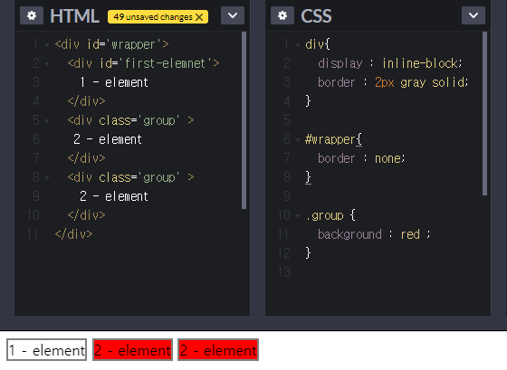

해당 게시물은 [부스트코스] - 웹프로그래밍 [강의](CSS Selector)를 기반으로 합니다. 

### Summary
 - Selector 란 ( in CSS )
 - 다양한 Selector 
 - Selector in JS

### CSS selector 
 Selector란, CSS의 정보를 HTML의 elemnet에게 적용하기 위해서 해당 element을 지정하는 방법에 입니다.
 
가장 기본적인 selector로는 
 - id 
   
   HTML elemnet의 id 속성 값을 지정 
   주로 단 하나의 요소만을 지정하며 중복되지 않게 지정하는 것을 권장

 - class

   HTML elemnet의 class 속성 값을 지정 
   다양한 요소를 하나의 name으로 지정하여 선택할 때 사용하는 것을 권장

 - tag 

   HTML내의 '<>' 내부에 들어가 있는 정보를 의미

### 더 다양한 Selector
 위의 3가지를 기반으로 다양한 selector가 존재합니다.
 많이 사용되는 selector들을 위주로 설명하겠습니다.

 - class 합집합 

   ex.  .group01 .group02
   class명 사이에 공백이 있는 존재합니다. 이런 경우 두 가지 중 하나만으로도 선택이 됩니다.

- class 교집합 

   ex.  .group01.group02
   class명 사이에 공백이 없습니다. 이런 경우 두 가지의 class 명을 다 지니고 있어야 선택됩니다.

- 속성 선택자 (Attribute Selector)

   ex.  a[ href ]  
   해당 속성이 존재하는 값들에게 적용, 기호는 정규표현식의 연산과 유사합니다.
   
   \+ 속성의 값까지 적용이 가능합니다.
   \+ ='value'  : 속성과 값까지 일치하는 경우 선택
   \+ ~='value' : 속성 값들 중 공백으로 구분된 값이 존재하는 경우
   \+ |='value' : 속성과 값이 일치 또는 하이픈'-'으로 시작하는 경우
   \+ &='value' : 속성과 값이 value로 끝나는 경우
   \+ *='value' : 속성과 값이 value을 포함하는 경우

- 후손 선택( 공백 )

   ex.  div p 
   div 하위 모든 p tag는 모두 선택이됩니다.

- 후손 선택( > )

   ex.  div p 
   여기서 중요한 점은 div 바로 아래 후손만을 선택합니다.
   

#### 가상 클래스 ( pseudo selector ) 
 가상 클래스란, 단순히 표현할 수 없는 element의 상태를 나타냅니다.

##### 동적 선택자 ( Dynamic pseudo class )
 - :hover 

   마우스가 해당 elemnet위에 존재할 때 해당 element을 선택

 - :visited :link :active

   주로 a(ancher) 태그와 사용

 - :focus 
   키보드에서 입력이 들어올 때 반응하는 위치를 정하는 Focus가 지정된 element을 나타냄
   주로 input 태그에서 사용이 됩니다.
   
##### 구조 선택자 ( Strucural states pseudo class )
 - first-child / :last-child

   선택자의 첫번째/ 마지막 자식 요소 선택

 - :nth-child(n) / :nth-last-child(n)

   선택자의 앞에서/ 마지막에서 n번째 자식 요소 선택
   n은 정수로 0부터 시작합니다.

 - empty

 
##### UI 요소 상태 셀렉터( UI element states pseudo classes )
 - :checked 

   선택자가 체크 상태

 - :enable

   사용이 가능한 상태

 - :diabled 
 
   사용이 불가능한 상태 

#### Selector in JS
 CSS의 Selector의 개념은 CSS에서만 사용되는 것은 아닙니다. JS에서 해당 요소의 여러 기능을 구현하는 면에서 해당 요소로 접근해야하는 일은 빈번하게 일어납니다. 함수는 브라우저의 documnet 객체의 함수로 존재하며, 추가적인 설치가 필요하지 않습니다.

##### querySelector( CSS Selector )
 CSS로 선택되는 값이 2개이상이면, 배열의 가장 첫번째 요소를 반환합니다.
 
 ex.  document.querySelector(".example");

##### querySelectorAll ( CSS Selector ) 
 CSS로 선택되는 값이 2개이상이면, 배열의 형태로 반홥합니다.

 ex.  document.querySelectorAll(".example");

##### id, class 지정
 - getElementById ( ID )
 - getElementsByName ( Name )
 - getElementsByTagName ( Tag )
 - getElementsByClassName ( Class )

 ex.  document.getElementsByClassName("example");

### 참조

#### post 
 - post 01  : [CSS3 Selector](https://poiemaweb.com/css3-selector)
 - post 02  : [Pseudo Class와 Pseudo Element 활용하기](https://asfirstalways.tistory.com/184)
 - post 03  : [무엇이 더 빠를까?](http://blog.nekoromancer.kr/2014/04/04/vs-%EB%86%80%EC%9D%B4-%EB%AC%B4%EC%97%87%EC%9D%B4-%EB%8D%94-%EB%B9%A0%EB%A5%BC%EA%B9%8C/)

#### 추가 정보
 - css 연습 page : [flukeout.github.io](https://flukeout.github.io/)
 - CSS selector : [w3schools] (https://www.w3schools.com/cssref/css_selectors.asp )
 - JS selevtor  

[부스트코스](https://www.edwith.org/boostcourse-web) "부스트 코스 메인 페이지"
[강의](https://www.edwith.org/boostcourse-web/lecture/16676/) "정리한 페이지"

