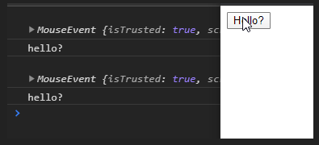

해당 게시물은 [ 부스트코스 ] - 웹프로그래밍 강의( Browser Event, Event object, Event handler )를 기반으로 합니다. 

### Summary
 - Event 란
 - Event 요소
 - Event 사용법

### What is event?
 
 이벤트란 비주기적 또는 비동기적으로 일어나는 일을 의미합니다. 정리하면, 특정 일이 일어나지만, 그 빈도와 주기는 알 수 없으며, 특정 대상 또는 상황에 일어나는 일을 의미합니다.

 웹에서는 이벤트는 매우 다양합니다. 예제로

  - 키보드 또는 마우스 입력
  - 브라우저의 창 크기 변화

  등이 이외에 많은 경우가 존재합니다.

### Event의 요소

 이벤트는 크게 3가지의 요소로 구분이 되어집니다.

 - 이벤트 발생자 ( Target )
  이벤트가 일어날 객체를 의미합니다. 보통 하나의 Dom elemnet 단위로 지정을 합니다.

 - 이벤트 종류 ( Type )
  같은 객체에 대해서, 일어난 이벤트를 의미합니다. 하나의 element에서라도 click, change등이 존재할 수 있습니다.

 - 이벤트 발생 시, 행동 ( Handler )
  이벤트가 일어났을 때 일어나는 실행될 함수를 정의합니다.


### Event 사용하기!

 그렇다면 이벤트는 어떻게 사용할까요? 이벤트를 사용하기 위해서는 target 객체에 이벤트를 등록하는 과정이 필요합니다. 크게 두 가지 방법이 존재합니다.
 
  - Event Listner 사용
  event, handler을 모두 생 후 이를 연결

```js
  //target 지정
  var elem = document.getElementById('button')

  //event 생성
  var event = new Event('push');

  // event 등록
  elem.addEventListener('push', function (e) { console.log('pushed!') });

  // event 발생
  elem.dispatchEvent(event);

  결과 
  pushed!
  true
```


  - DOM element에 속성으로 추가
  미리 정의되어 있는 리스너에 handler을 등록

```html

  <button id='button'>
    Hello?
  </button>
  <script type="text/javascript">
    //target 지정
    var btn = document.getElementById("button"); 
    //event 지정
    btn.onclick = function(event){
      console.log(event);
      console.log('hello?')
    }
  </script>

```





##### Event 정리


### 생각해보기
 1. event type에는 어떤 것들이 있나요? 마우스, 키보드 관련 타입 들을 자세히 알아보세요.

 Mouse Event에는 다양한 값이 존재합니다. 대표적으로

  - 입력이 들어온 객체
  - screen / layout/ page/... 등 상의 위치
  - ctrl / alt / shift key, push 여부

UI에 대한 위치정보, 상호작용할 키의 여부 등등이 존재합니다.

다음 글에서는 이벤트가 다른 element로 전파되어지는 과정에 대해서 알아보도록 하겠습니다.

### 참조

#### post 
 - post 01 : [event 란 무엇인가?](https://webclub.tistory.com/340)

#### 추가 정보
 - MDN web docs : [이벤트 생성 및 트리거](https://developer.mozilla.org/ko/docs/Web/Guide/Events/Creating_and_triggering_events)

해당 게시물은 [ 부스트코스 ] - 웹프로그래밍 강의(  Browser Event, Event object, Event handler )를 기반으로 하얐습니다. 
더 자세한 내용에 대해서 알고 싶으시다면, 아래에 안내되는 페이지에서 확인할 수 있습니다.

부스트코스 메인 페이지 :  https://www.edwith.org/boostcourse-web
이번 포스트와 관련된 페이지 : https://www.edwith.org/boostcourse-web/lecture/16700/


[부스트코스]:(https://www.edwith.org/boostcourse-web) "부스트 코스 메인 페이지"
[강의]:() "정리한 페이지"


