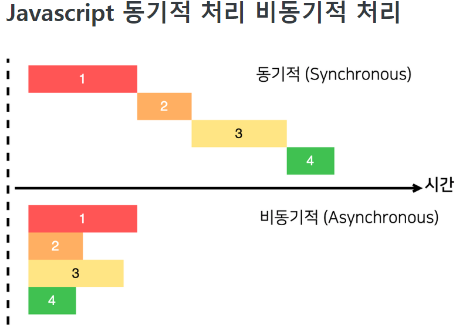
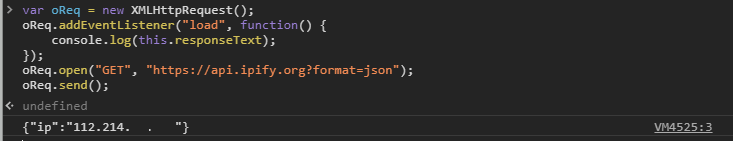

해당 게시물은 [ 부스트코스 ] - 웹프로그래밍 강의( Ajax 응답 처리와 비동기 )를 기반으로 합니다. 

### Summary
 - Ajax란?
 - 비동기란?

### What is Ajax?
 Ajax(Asynchronous Javascript And Xml)란 비동기적으로 자바스크립트를 실행(통신)하며 이 결과를 xml의 형태로 서버와 클라인언트가 데이터를 주고 받는 과정을 의미합니다.

 너무 장황하게 설명한거 같습니다. 조금 더 간략하게 설명해보겠습니다.
 해당 페이지의 데이터가 다른 서버나 DB에 존재하는 경우, 새로운 데이터를 보기 위해서는 서버에 새로운 HTML을 받아와야 했습니다.
 이러한 과정 중에는 큰 단점이 존재합니다.

 - 중복된 데이터를 지속적으로 받아옵니다.

 - 페이지가 변화 할 때마다 서버와 통신을 합니다
    데이터를 얻어오고, 이를 가공하여 html파일을 만들어내는것은 server-side임을 기억해야합니다.

 Ajax을 사용한다면 위의 문제를 대폭 해결할 수 있습니다.

 그럼 Ajax는 이러한 문제를 어떻게 해결했을까요?
 Ajax는 비동기 개념을 사용하여 이 문제를 해결합니다.

##### 비동기란
 여기서 다시 비동기적이라는 것은 무엇일까?
 비동기란 한 작업이 끝날 때 까지 기다리는 것이 아니라 다른 작업을 동시에 진행하는 것을 의미합니다.

 ? CPU는 분명 제한된 성능이 존재하는데 여러 작업을 진행할 수 있을까 ?
 서버나 DB에서 데이터를 얻어오기 기다리지 않고, 클라이언트 쪽의 다른 작업을 처리하는 것을 의미합니다.

 더 간단히 설명하자면, 택배를 주문하고 배송되기 전까지, 다른 일을 처리하는 것과 유사합니다.
 택배가 오기전까지 택배만 기다린다면 너무 비효율적이겠죠?

 이것이 웹의 예제가 된다면, 데이터를 오기까지 기다린다면, 클라이언트에서는 마우스를 움직일 수도, 스크롤을 내릴 수도 없는 block된 상황이 됩니다.
 이러한 비효율적인 상황을 해결하기 위해서 '비동기적' 라는 개념을 사용하게 됩니다. 

 다행히도 웹에서 사용하는 자바스크립트는 비동기적 처리에 특화되어 있는 언어입니다.
 정확히 Event을 사용하는 언어로 비동기적 언어를 기본적을 사용하는 언어입니다.
 
 더 정확한 내용은 https://www.youtube.com/watch?v=8aGhZQkoFbQ 영상을 참조하시기 바랍니다.



### XMLHTTPRequest
 Ajax는 라이브러리가 아닙니다. 하나의 개념일 뿐이며 이를 구현하는 방법은 다양하게 존재합니다.
 따라서 Ajax을 하는 방법은 다양하며 그 종류로는 
 
 - jQuery 
 - XMLHTTPRequest
 - fetch
 - axios

 등이 있으며 해당 포스트에서는  XMLHTTPRequest을 사용하고자 합니다.


### How to use Ajax
 XMLHTTPRequest도 정확히는 하나의 객체입니다. ajax을 하기 위해서 하나의 인스턴스를 만들어내고 해당 인스턴스을 이용하여 통신을 하는 것 입니다.


 - onload, onloadstart, onerror, ... 
    on 키워드를 달고 있는 것이 존재합니다. JS에서 이벤트가 발생 시 이를 처리하는 Handler을 참조하는 변수의 이름에 on을 자주 사용합니다.
    즉 onload는 load 이벤트가 발생한 경우 onload가 참조하는 함수를 실행하라고 이해하면 됩니다.

 - open
    Ajax을 위한 기본적인 데이터 URL, 통신 방식등을 정의합니다. 
    send을 한 후에는 다시 open을 해주여야 합니다.

 - send
    XMLHTTPRequest 객체 내의 데이터를 참조하여 서버에 실질적 요청을 보내는 함수 입니다.

 이후 해당 통신의 결과에 따라 이벤트가 발생하게 됩니다.

### 예제 
 그렇다면 간한게 예제를 하나 보겠습니다.
 아이피를 얻어오는 예제입니다. 이를 위해서 ipify라는 페이지를 사용하였습니다.

 1. XMLHttpRequest 생성 
 2. 이벤트 등록 
 3. open으로 준비
 4. send

 ```javascript
    var oReq = new XMLHttpRequest();
    oReq.addEventListener("load", function() {
        console.log(this.responseText);
    });
    oReq.open("GET", "https://api.ipify.org?format=json");
    oReq.send();

    //result
    //{"ip":"xxx.xxx.xxx.xxx"}
 ```



위와 같이 Block되지 않고 정상적으로 처리가 되어지는 것을 볼 수 있었습니다.
이외에 다른 특징들을 지닌 fetch, axios에 대해서는 다음 포스팅에서 알아보도록 하겠습니다.

### 참조

#### image
 - boostCourse-10.png: [[JS] 비동기 처리 ( Promise / async&await )](https://velog.io/@smooth97/ES8-async-await)

#### 추가 정보
 - MDN web docs : [Using XMLHttpRequest](https://developer.mozilla.org/en-US/docs/Web/API/XMLHttpRequest/Using_XMLHttpRequest)
 - ipify : [ipify 메인 페이지](https://www.ipify.org/)

해당 게시물은 [ 부스트코스 ] - 웹프로그래밍 강의(  Browser Event, Event object, Event handler )를 기반으로 하얐습니다. 
더 자세한 내용에 대해서 알고 싶으시다면, 아래에 안내되는 페이지에서 확인할 수 있습니다.

부스트코스 메인 페이지 :  https://www.edwith.org/boostcourse-web
이번 포스트와 관련된 페이지 : https://www.edwith.org/boostcourse-web/lecture/16756/


[부스트코스]:(https://www.edwith.org/boostcourse-web) "부스트 코스 메인 페이지"
[강의]:(https://www.edwith.org/boostcourse-web/lecture/16700/) "정리한 페이지"


