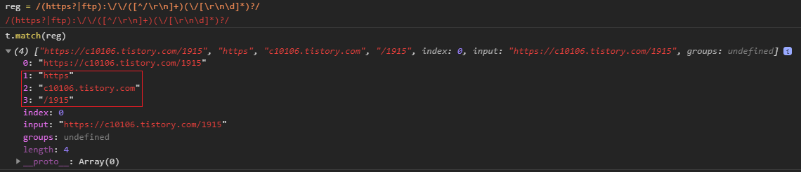
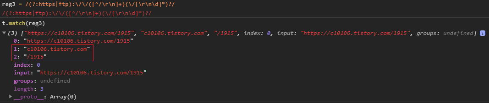
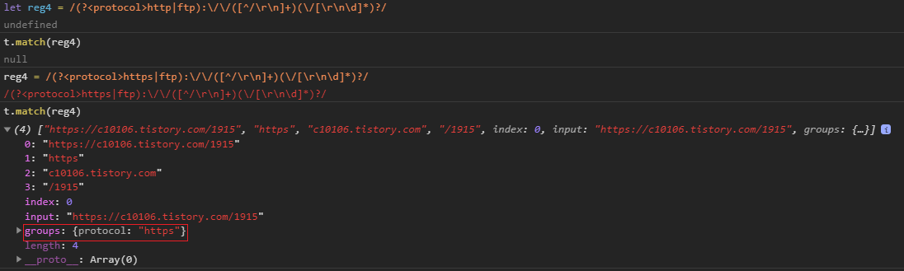

해당 게시물은 [ 부스트코스 ] - 웹프로그래밍 강의( Ajax 응답 처리와 비동기 )를 기반으로 합니다. 

### Summary
 - 정규표현식이란
 - 정규표현식 사용

### What is regular expression?
 정규표현식이란 특정한 규칙을 가진 문자열의 표현하는 형식언어입니다. 문자열의 검색과 치환을 지원합니다. 

 그렇다면 왜 정규표현식을 사용하는 것일까요?

 프로그래밍에서 String, 문자열 단위로 된 데이터를 자주 사용합니다. 이러한 문자열을 효과적으로 처리하기 위해서 사용합니다. 즉 크게 3가지의 역할을 수행합니다.
  - 문자 검색
  - 문자 대체
  - 문자 추출
 이 그 예입니다.
  

 이러한 정규표현식은 실무에서 어떻게 사용이 될까요?
 예로는 
  - 이메일, 주소, 전화번호 구칙 검증
  - textarea에 입력된 것 중 불필요한 입력값을 추출
  - 트랜스파일링
  - 개발 도구에서의 문자열 치환 
 등에서 사용이되어집니다.

### How to use?
 정규표현식는 표현식을 정의하는 패턴과 패턴을 적용할 타켓이 존재합니다.

 패턴은 문자들과 기능을 나타내는 연산자들 그리고 추가 기능으로 이루어지게 됩니다.


##### 연산자
 1. Ancher - ^ , $ 그리고 .
 - ^[ 문자열 ], 문자열로 시작하는 문자열을 매칭합니다.
   ex) ^AB 
   test 문자열 : ABC ABBC CAB
   match된 문자열 : ABC ABBC

 - [ 문자열 ]$, 문자열로 끝나는 문자열을 매칭합니다.
   ex) AB$
   test 문자열 : ABC ABBC CAB
   match된 문자열 : CAB
   
 - [ 문자 ]., 문자 뒤 임의의 한 문자와 일치
   ex) A.
   test 문자열 : ABC ABBC CAB
   match된 문자열 : ABC ABBC CAB

   
 2. Quantifiers - *, +, ? and {}
 - [ 문자 ]*, 문자가 0개 이상 포함한 문자열을 매칭합니다.
   ex) AB* A 그리고 0개 이상의 B로 이루어진 문자열
   test 문자열 : A AB ABBB ABABB ABBBBB  ABBBBBBB
   match된 문자열 : A AB ABBB ABABB ABBBBB  ABBBBBBB

 - [ 문자 ]+, 문자가 1개 이상 포함한 문자열을 매칭합니다.
   ex) AB+, A 그리고 1개 이상의 B로 이루어진 문자열
   test 문자열 : A AB ABBB ABABB ABBBBB  ABBBBBBB
   match된 문자열 : AB ABBB ABABB ABBBBB  ABBBBBBB

 - [ 문자 ]?, 문자가 0개 또는 1개 포함한 문자열을 매칭합니다.
   ex) AB?, A 그리고 0개 또는 1개의 B로 이루어진 문자열 
   test 문자열 : A AB ABBB ABABB ABBBBB  ABBBBBBB
   match된 문자열 : A AB ABBB ABABB ABBBBB  ABBBBBBB

 - [ 문자 ]{n,}, 문자가 n개 이상 포함한 문자열을 매칭합니다.
   ex) AB{2, }, A 그리고 2개 이상의 B로 이루어진 문자열  
   test 문자열 : A AB ABBB ABABB ABBBBB  ABBBBBBB
   match된 문자열 : ABBB ABABB ABBBBB  ABBBBBBB

 - [ 문자 ]{n,m}, 문자가 n개 이상 m개 이하를 포함한 문자열을 매칭합니다.
   ex) AB{4, 5}, A 그리고 2개 이상 5개 이하 B로 이루어진 문자열  
   test 문자열 : A AB ABBB ABABB ABBBBB  ABBBBBBB
   match된 문자열 : ABBBBB  ABBBBBBB

 ? 문자가 아닌 문자열을 패턴 대상으로 사용하고 싶으면 ?
 ()을 이용하여 패턴을 적용한 문자열을 감싸면 됩니다.
   ex) A(BC)*, A(BC)+, A 그리고 BC 문자열이 0개 이상으로 이루어진 문자열
   test 문자열 : ABC ABBC
   match된 문자열(A(BC)*) : ABC ABBC
   match된 문자열(A(BC)+) : ABBC

 3. OR operator — | or []
 - [ 문자 ] | [ 문자 ], 두 문자 중 하나라도 해당하는 문자로 이루어진 문자열
   ex) A(B|C), A 그리고 1개 이상의 B 또는 C로 이루어진 문자열 
   test 문자열 : A AB AC ADC ADB
   match된 문자열 : AB AC

   ex) A(B|C)*, A 그리고 0개 이상의 B 또는 C로 이루어진 문자열 
   test 문자열 : A AB AC ADC ADB
   match된 문자열 : A AB AC ADC ADB 

 4. Character classes — \d \w \s and .
 - \d, 숫자 하나와 매칭
 - \w, 문자(숫자, 영문, _) 하나와 매칭
 - \s, 공백문자(\t, \n, space ) 하나와 매칭
 - . , 모든 문자 하나와 매칭

 ##### Flags , grouping 그리고 capturing
 1. Flags 
   정의한 패턴이 어디에 적용되는가? 
   - g(global), 문자열에 처번째 매칭 후, 꿑나지 않고 매칭되는 모든 항목을 찾음
   - m(multi-line) ancher (^ 또는 &)이 문자열 전체가 아닌, 줄 단위로 적용
   - i(insensitive), 대소문자 구분 없이 매칭
   - u(uniconde), 유니 코드 문자를 처리하여 매칭
 2. Grouping and capturing — ()
   여러 그룹으로 캡쳐된 결과를 배열로 반환합니다. 그룹 단위로 정규표현식을 검사 후 단위별로 배열의 원소 값으로 추가합니다.

   - ( 문자열 ), 문자열로 된 캡쳐 그룹을 생성
   ex) A(BC)



   - ( ?:문자열 ), 문자열로 된 캡쳐 그룹생성을 무시 합니다. 정규표현식과 일치는 하지만, 일치한 값을 배열에 추가하지 않습니다.
   ex) A(?:BC) 



   - ( ?< NAME > 문자열 ), NAME으로 된 갭쳐 그룹에 이름을 지정합니다.
   ex) A( ?< test >BC )



 3. Bracket expressions — []
   기본적으로 []은 operator의 or 과 유사한 동작을 합니다. 또한 []내부의 ^는 operator 달리 부정의 의미로 사용됩니다.
   - [abc] or [a|b|c] or [a-b]
   모두 a,b,c 중의 하나를 포함한 문자열을 매칭
   ex) [a-fA-F0-9] 16진수의 문자 하나와 매칭 , 대소문자를 구분하지 않음
   ex) [0-9]%, 숫자와 그리고 %문자를 포함한 문자열과 매칭
   ex) [^a-zA-Z], 영문이 아닌 문자와 매칭

### on js
 그렇다면 정규표현식을 JS에서는 어떻게 사용을 할까요?
 
 1. 생성자 
  - RegExp 사용
```Javascript
   const regexp = new RegExp("^ABC")
```

  - 리터럴 객체 사용
```Javascript
   const regexp = /^ABC/
```

 2. 함수( Method )
   - exec : 일치하는 하나의 정보 반환
   - test : 일치하는 여부 반환
   - match : 일치하는 문자열의 배열 반환
   - search : 일치하는 문자열의 인덱스 반환
   - replace : 일치하는 문자열을 대체하고 대체된 문자열 반환
   - split 일치하는 문자열을 분할하여 배열로 반환
   - toString : 생성자 함수 방식의 정규식을 리터럴 방식의 문자열로 반환 
   
 예제
```Javascript
   "abc".match(/(b)?(a)?(c)?(b)?/);

   //result : ["ab", undefined, "a", undefined, "b", index: 0, input: "abc", groups: undefined]

   "011-021-0011".replace(/(\d{2})\d/, "$10");;
   //result : "010-021-0011"
```

 기본적인 정규표현식에 대해서 알아 보았습니다.
 이 이외에 심화 내용으로  
 - Boundaries — \b and \B
 - Back-references — \1
 - Look-ahead and Look-behind — (?=) and (?<=)
 등이 존재합니다.

 이와 더 자세한 예제들은 다음 포스팅에서 더 자세히 알아보도록 하겠습니다.

### 참조

#### image
 - boostCourse-10.png: [[JS] 비동기 처리 ( Promise / async&await )](https://velog.io/@smooth97/ES8-async-await)

#### post 
 - post01 : [RegExp 정규식 Flag 플래그](https://dol2156.tistory.com/228)
 - post02 : [[정규식] 핵심만 모아놓은 Cheat Sheet](https://medium.com/@chrisjune_13837/%EC%A0%95%EA%B7%9C%EC%8B%9D-%ED%8A%9C%ED%86%A0%EB%A6%AC%EC%96%BC-%EC%98%88%EC%A0%9C%EB%A5%BC-%ED%86%B5%ED%95%9C-cheatsheet-%EB%B2%88%EC%97%AD-61c3099cdca8)
 - post03 : [정규표현식에서 캡쳐하지 않은 그룹이란 무엇입니까?](https://c10106.tistory.com/1915)
 - post04 : [정규표현식 이렇게 시작하자](https://heropy.blog/2018/10/28/regexp/)

#### 추가 정보 
 - regular expressions : [regex101](https://regex101.com/)
 - MDN web docs : [Using XMLHttpRequest](https://developer.mozilla.org/en-US/docs/Web/API/XMLHttpRequest/Using_XMLHttpRequest)

해당 게시물은 [ 부스트코스 ] - 웹프로그래밍 강의( 정규표현식이란? )를 기반으로 하얐습니다. 
더 자세한 내용에 대해서 알고 싶으시다면, 아래에 안내되는 페이지에서 확인할 수 있습니다.

부스트코스 메인 페이지 :  https://www.edwith.org/boostcourse-web
이번 포스트와 관련된 페이지 : https://www.edwith.org/boostcourse-web/lecture/16796/


