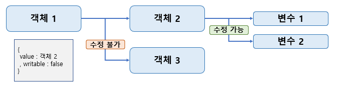
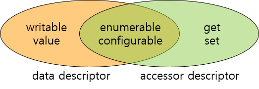

해당 게시물은 [ 부스트코스 ] - 웹프로그래밍 강의( 생성자패턴 )를 기반으로 합니다. 

### Summary
 - 생성자 패턴이란
 - JS 객체 프로토타입

 생성자 패턴에 대해서 설명하기 전에 JS에서는 객체를 어떻게 만들까요?

 1. 객체 리터럴 사용
 ```javascript 
   var healthObj = {
      name : "크롱",
      lastTime : "PM10:12",
      showHealth : function() {
         console.log(this.name + "님, 오늘은 " + this.lastTime + "에 운동을 하셨네요");
      }     
   }

   healthObj.showHealth();

   // 결과 값 
   // 크롱님, 오늘은 PM10:12에 운동을 하셨네요

 ```

와 같이 생성이 가능합니다.

하지만 위와 같은 경우 원하는 객체를 만들기 전에 이미 코드 상에 코딩이 되어 있어야 합니다.

이것은 동적으로 데이터가 생겨나는 경우에는 사용할 수 없고 사용이 가능하더라도 너무 번거롭고 유지 보수가 힘들어 집니다.

2. 동적 생성
```javascript
   function Health(name, lastTime) {
      this.name = name;
      this.lastTime = lastTime;
      this.showHealth = function(){
         console.log(this.name + "님, 오늘은 " + this.lastTime + "에 운동을 하셨네요");
      }
   }
   const h = new Health("크롱", "10:12");
   const h2 = new Health("뽀로로", "10:12");
   
   h.showHealth();
   h2.showHealth();
   // 결과 값
   // 크롱님, 오늘은 PM10:12에 운동을 하셨네요
   // 뽀로로님, 오늘은 10:12에 운동을 하셨네요
 ```
위와 같이 값을 함수의 인자로 넘겨주어 객체를 동적으로 생성하는 방법이 있습니다.

### What is Constructor Pattern?
 위의 동적 생성의 예시가 객체를 만들어주는 Health 함수가 생성자이며, 이렇게 생성자를 이용하여 객체를 만들어 내는 것을
 생성자 패턴이란 말합니다.

 원래 생성자 패턴이란 JS 이외에 C++, JAVA... 등 객체 지향적 프로그래밍 언어의 주요한 특징 중 하나 입니다.
 하지만 JS에서는 다른 언어보다 유연하며, 생성자를 필요에 따라 변경하기에 자유지만 이에 따른 주의해야할 점도 존재합니다.

### What is prototype?
 프로토타입의 뜻은 ' 원래의 형태 또는 전형적인 예, 기초 또는 표준 '[ 위키백과 ] 으로 정의 되어 있습니다.
 생성자 패턴으로 생성된 객체들은 각자의 scape ( 영역 )을 지니며, 각 영역은 따로 존재합니다.
 그래서 객체마다 자신의 변수를 소유할 수 있었습니다.

 하지만 객체마다 공통적으로 지니고 있는 변수 및 함수가 존재한다면 어떨까요? 
 같은 기능의 함수를 각 객체마다 지니고 객체가 생성 될 때 마다
 함수도 함께 복사(깊은 복사)한다는 것은 매우 비효율적이며, 메모리에 부담이 될 수 있습니다.

 따라서 중복되어지는 함수를 프로토타입으로 지정하고 객체가 해당 함수를 사용 시 프로토타입에 존재하는 함수를 사용하게 함으로써 
 여러 문제를 해결 할 수 있습니다.

 

 예를 한 번 보겠습니다.

```javascript
   function Health(name, lastTime) {
      this.name = name;
      this.lastTime = lastTime;
   }

   Health.prototype.showHealth = function() {
      console.log(this.name + "," + this.lastTime);
   }

   const h = new Health("달리기", "10:12");
   const h2 = new Health("걷기", "14:20");
   console.log(h.showHealth === h2.showHealth); 
    
   // 결과 값
   // true
```

### 이외에 객체를 생성하는 방법 - Object.create 사용
 이외에도 JS에서는 다양한 방법으로 객체를 생성할 수 있습니다.

 Object 자체적으로 객체를 만들어내는 함수를 지원합니다. 그것이 create 입니다.

```
   Object.create(proto[, propertiesObject])
```

 이 함수의 특징이 있는데 존재하는데 첫 번째 인자를 프로토타입으로서 사용하며, 두 번째 인자는 해당 객체의 속성이 됩니다.

 ```javascript
   let t = Object.create( {}, 
    { 'name'        : { value : '크롱' } ,
      'lastTime'    : { value : '10:12' },
      'showHealth'  : { value : 
         function() {
            console.log(this.name + "님, 오늘은 " + this.lastTime + "에 운동을 하셨네요");
         }
      }
    } 
   )
   t.showHealth()
   // 결과 값
   // 크롱님, 오늘은 10:12에 운동을 하셨네요
```
 이와 같이 create을 이용 할 경우 동적 생성이 가능합니다. 하지만 이 자체만으로는 리터럴 방식에 가까움으로 함수를 통해서 
 인자를 받고 그 값을 기반으로 객체르 만들어 반환하는 팩토리 패턴이 함께 사용이 되어야 합니다.

 생성자 패턴보다 번거로운 작업을 하면서 까지 create을 사용하는 이유는 무엇일까요?

 create을 사용시 변수에 대해서 세세한 설정을 해 줄 수 있습니다. 

 설정에 예로는 
 1. 직접 데이터를 지정하는 속성 
  - writable   :  차후에 변수의 값이 변경이 가능한가?
   변수가 참조하는 값은 변하지 않으나, 참조하는 값의 내부적 변화는 가능하다.
   ex) 다른 객체를 참조 중이며, 참조 중인 객체의 내부 변수가 변화 하는 경우는 가능
    

 - value : 변수에 값을 직접 지정합니다.

 2. 간접 데이터를 지정하는 속성
  - get / set : 데이터를 저장하고 읽는데 전처리 작업을 수행 할 수 있습니다.

3. 공통 속성
 - enumerable  : for in 또는 Object.keys에서 해당 속성을 노출할지 여부

 - configurable : 차후에 delete 연산으로 객체에서 삭제가 가능한지 여부

 등의 속성을 정의 할 수 있으며, 이를 통해 객체를 보다 안전하게 사용이 가능합니다.

 
 

### Class 사용
 JS에서도 class을 지원합니다. 언어 자체에서 class을 사용하기 위해서 문법을 만들어낸것은 아니며
 class을 사용 시 이전의 문법들로 변환을 하여 class가 작동 하듯이 만들어 냈습니다.
 아직까지는 이를 ' syntax sugar '일지 아님 기존의 js의 방식을 대체할 지는 더 지켜봐야 할 것 입니다.
 이에 대한 정보는 참조 post 2에서 자세히 확인해보시면 될 것 같습니다.
 
이외에 class에 대한 자세한 내용은 차후 다음 post에서 다루도록 하겠습니다.

### 참조
 - post 1 : [Object 2. 보다 안전한 객체](https://www.bsidesoft.com/?p=1878) 
 - post 2 : [ES6 Class는 단지 prototype 상속의 문법설탕일 뿐인가?](https://gomugom.github.io/is-class-only-a-syntactic-sugar/)
#### image
 - boostCourse-16.png : [ [부스트코스] 웹 프로그래밍 ](https://www.edwith.org/boostcourse-web/lecture/16794/)
 - boostCourse-18.png : [Object 2. 보다 안전한 객체](https://www.bsidesoft.com/?p=1878)

#### 추가 정보
 - MDN web docs : [Object.create()](https://developer.mozilla.org/ko/docs/Web/JavaScript/Reference/Global_Objects/Object/create)
 - MDN web docs : [Object.defineProperty()](https://developer.mozilla.org/ko/docs/Web/JavaScript/Reference/Global_Objects/Object/defineProperty)

해당 게시물은 [ 부스트코스 ] - 웹프로그래밍 강의( 생성자패턴 )를 기반으로 하얐습니다. 
더 자세한 내용에 대해서 알고 싶으시다면, 아래에 안내되는 페이지에서 확인할 수 있습니다.

부스트코스 메인 페이지 :  https://www.edwith.org/boostcourse-web
이번 포스트와 관련된 페이지 : https://www.edwith.org/boostcourse-web/lecture/16794/


[부스트코스]:(https://www.edwith.org/boostcourse-web) "부스트 코스 메인 페이지"
[강의]:(https://www.edwith.org/boostcourse-web/lecture/16700/) "정리한 페이지"


