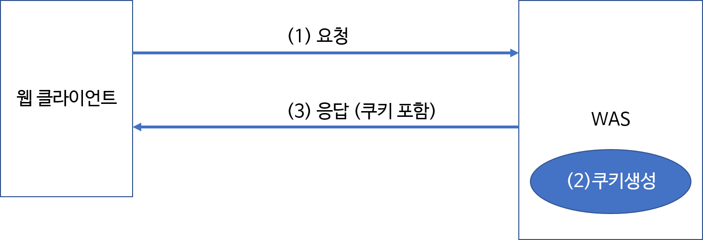
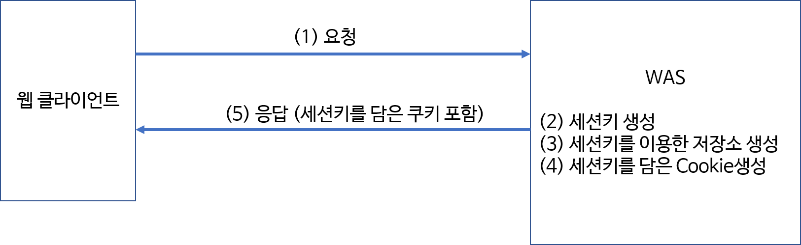
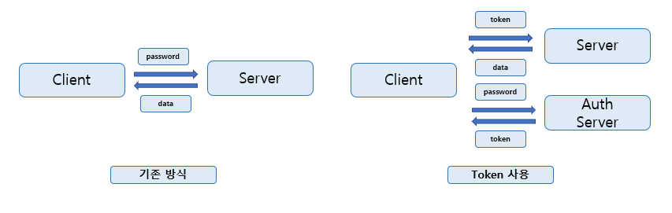
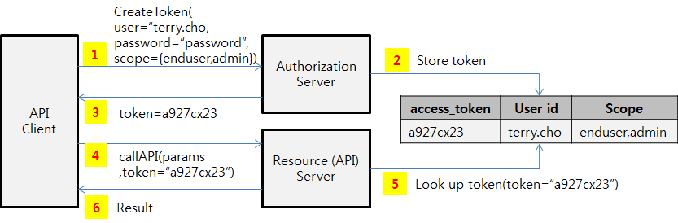
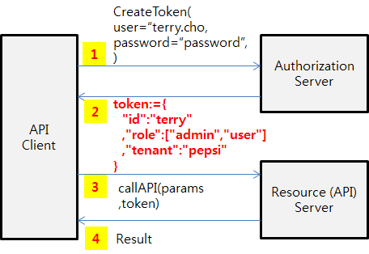

해당 게시물은 [ 부스트코스 ] - 웹프로그래밍 강의( 상태정보 )를 기반으로 합니다. 

### Summary
 - 상태정보란
 - 쿠키 (Cookie)
 - 세션 (Session)
 - 토큰 (token)
 - JWT (Json Web Token )

### 상태정보
 웹 프로그래밍을 시작하기 전 http/https에 대한 알아보았습니다. 이때 가장 큰 특징 중에 하나가 있습니다.

 http/https는 stateless을 유지한다는 것입니다. 하지만 웹에서 여러 기능을 사용하다보면 state을 유지해야 하는 경우가 존재합니다.

 예를 들어 로그인 기능 또는 정보 저장( 장바구니, 목록 등.. )의 기능이 필요로 합니다.

 그렇다면 http의 stateless 특징을 유지하면서 state을 유지해야하는 모순적인 방법이 없을까요?

 이때 Cookie와 Session 기술이 등장하게 됩니다.

 둘의 공통점은 stateless한 http 프로토콜에 state을 생성해 준다는 점입니다.

 차이점으로 해당 정보를 클라이언트에 저장하는가 서버에 저장하는가 라고 볼 수 있습니다.

### 쿠키 (Cookie)
 쿠키란 정보를 클라이언트에 저장하는 방법을 의미합니다. 

 쿠키가 생성되는 과정은 아래와 같습니다.

 

 가장 간편하게 state을 담은 Cookie을 생성 후 이를 클라이언트(PC)에 저장 후 이를 http 통신을 보낼 때 header에 담아서 보냅니다.

 쿠키의 특징으로는

  - 사용자 컴퓨터에 저장
  
  - 저장된 정보를 다른 사람 또는 시스템에서 접근이 가능

  - 유효기간이 경과 시 사라짐

 정도가 있습니다. 정보가 http 통신마다 포함되어지며 접근이 비교적 쉽다는 점에서 중요한 정보를 쿠키에 저장하는 것은 보안상 좋은 선택은 아닙니다.

### 세션 (Session)
 세션이란 새로운 개념이 아닌 쿠키를 이용한 방법입니다.

 세션이 생성되는 과정은 아래와 같습니다.

 

 쿠키와 크게 대비되는 점은 쿠키가 생성되나 실제로 정보는 쿠키가 아닌 서버에 세션에 저자잉 된다는 점입니다.

 생성된 쿠키는 이 세션에 접근하기 위한 Key의 값을 저장하는 공간으로 사용이 됩니다.

 세션의 특징은

  - 정보가 서버에 저장

  - 서버가 종료되거나 유효시간이 지나면 사라짐

  - http 통신에는 세션 Key(쿠키)만 포함됨으로 쿠키보다 비교적 크기가 작음

  등이 있습니다.

  쿠키를 이용하여 정보를 처리하는 것보다 보안 및 효율면에서는 만은 개선되었습니다.

  하지만 정보를 서버에 저장한다는 점은 서버에서 처리해야 하는 작업이 증가하며 물리적으로 데이터를 저장하는 물리적 공간이 필요하다는 점에서

  무한적으로 세션을 생성할 수 없으며, 다중에 클라이언트와 통신을 하는 서버에 경우, 세션의 관리에 문제가 생긴다면 서버에 큰 영향을 줄 수 있습니다.

  이점을 유의하여 세션을 이용하여야 합니다.

### 생각해보기 
 쿠키, 세션 이 두 가지 이외에 또 state을 유지하는 방법이 존재할까요?

 토큰 및 JWT 라 불리는 방식이 존재합니다. 이에 대해서 더 자세하 알아보도록 하겠습니다.

### 토큰 (token)
 토큰의 근본적인 의미는 화폐대신 사용할 수 있는 동전 모양의 주조물을 의미합니다. 

 웹 상에서 개개인을 확인하는 가장 단순한 방법은 개인식별번호, 즉 비밀번호를 이용하는 것입니다.

 하지만 비밀번호를 직접적으로 사용한다는 것은 많은 위험성을 지니고 있습니다.

 비밀번호가 누출된 경우 이를 폐기하고 다시 새로운 비밀번호를 생성하는 것은 매우 번거로운 일입니다.

 또한 해당 비밀번호가 다른 홈페이지에서도 사용되고 있다면 더 큰 피해를 생성할 수 있습니다.

 이에 비밀번호를 이용하여 별도의 토큰을 생성하며, 해당 토큰을 통해서 개인을 식별할 수 있습니다.

##### Token의 구조
 토큰 시스템을 이루는 요소는 아래와 같습니다.

 1. 토큰 요청자 ( client )

 2. 토큰 생성자 ( auth server )

 3. 토큰 사용자 ( server )

 
 
 와 같은 방식으로 이루어져 있습니다.

 ( 토큰을 이용하는 Oauth 개념을 이용하여 인증을 시도하게 되는데 Oauth에 대해서는 다음 포스팅에서 자세히 다루도록 하겠습니다. )

 대략적인 과정은 아래와 같습니다.

 

 발급 받은 토큰을 이용하여 해당 기능을 요청하며 server는 토큰을 생성한 서버에 접근하여 토큰의 유효성을 확인 후 이를 처리합니다.

##### Token은 어디에 저장할까?
 토큰은 저장하는 방법은 크게 두 가지가 있습니다.

 1. 웹 스토리지 또는 세션 스토리지에 보관
   클라이언트에서 바로 접근이 가능하므로, XSS(cross-site scripting)에 매우 취약합니다. 

 2. 쿠키를 이용하여 header을 통해 전달
   httpOnly 기능을 이용하여 JS 또는 다른 방법으로 접근을 방지할 수 있으나, CSRF(Cross-site request forgery)에는 여전히 취약하다.

 해당 토큰이 노출이 된다면, 피해가 생기는 것은 똑같은데 무엇이 다를까요?

##### 특징 

 1. 주기적으로 사용하는 토큰을 갱신함으로 노출되어도 지속적으로 기능을 사용할 수 없음 ( 토큰 갱신의 간편함 )

 2. 로그인 기능을 지원하는 페이지마다, 토큰의 종류를 다르게 함으로 비밀번호이 유출을 방지 ( 플랫폼 간 권한 구별 )

 3. 역으로 다양한 페이지에서 토큰을 공유함으로써 페이지마다 로그인 기능을 개별적으로 구현할 필요성이 사라짐 ( 플랫폼 간 권한 공유 )
   
   예로 근래 많이 사용되고 있는 간편 로그인을 예로 들 수 있습니다. 이는 차후에 더 자세히 다루도록 하겠습니다.

 4. CSRF(Cross-Site Request Forgery, 사이트 간 요청 위조) 방지

 5. CORS(Cross-Origin Resource Sharing)이 간편해짐

 등 다양한 특징과 장점 생기게 됩니다.

##### 단점 

 하지만 장정만 존재할 수 는 없지요! 토큰의 단점으로는

 1. XSS, CSRF 등 다양한 보안적 문제에 여전히 취약합니다.

 2. Token 탈취 시, 피해가 생길 수 있습니다.

 3. Token을 너무 자주 refresh하는 경우 서버에 부하를 줄 수 있습니다.

 등의 단점이 존재합니다.

### JWT (JSON Web Token)
 JWT와 토큰은 무슨 차이가 있을까요? 정확히는 JWT는 Token을 이용하는 방법 중 하나라 생각하시면 됩니다.

 위의 사진에서 Token을 생성하고, 유효성을 검사하는 auth server가 존재하는 것을 알 수 있습니다.

 JWT와 같은 경우 auth server에서 이를 토큰을 생성 후 이를 서버에 저장하지 않습니다. 

 해당 토큰이에 토큰읜 id/ 기능/ 암호화 방식 등 다양한 정보를 포함하여 발급을 합니다.

 

 그렇다면 해당 토큰을 받은 server는 이 토큰이 유효한지 아닌지 어떻게 구별을 할까요?

 간단하게도 받은 token과 정보를 바탕으로 정보를 토큰을 이용해 암호화 하여 받은 데이터와 암호화한 데이터가 같은지를 비교합니다.

##### 특징 

 1. auth server에 token을 별도로 저장하지 않아도 됨으로 부하를 줄임

 2. token 발급 이후로 부수적인 과정이 필요 없음으로 성능 향상

등의 특징이 존재합니다.

##### 단점

 1. 토큰을 탈취 당한 경우 강제 만료하기 쉽지 않다.

 2. 전송하는 데이터가 외부로 노출되기에 중요한 데이터를 전송하는데는 무리가 있다.

등의 단점도 존재합니다.

하지만 중요 데이터가 아닌, 공개되어 있는 데이터이며 이를 검증하며 전송하는기 위해서 사용하는데 있어서는 매우 발전된 방식이라 할 수 있습니다.

이렇게 상태를 유지하는 방법에 대해서 알아 보았습니다.

### 참조
 - post 1 : [서버 기반 인증, 토큰 기반 인증 (Session, Cookie / JSON Web Token)](https://dooopark.tistory.com/6) 
 - post 2 : [REST JWT(JSON Web Token)소개 - #1 개념 소개](https://bcho.tistory.com/999)  

#### image
 - boostCourse-19.png : [ [부스트코스] 웹 프로그래밍 ](https://www.edwith.org/boostcourse-web/lecture/16798/)
 - boostCourse-20.png : [ [부스트코스] 웹 프로그래밍 ](https://www.edwith.org/boostcourse-web/lecture/16798/)
 

#### 추가 정보
 - MDN web docs : [Object.create()](https://developer.mozilla.org/ko/docs/Web/JavaScript/Reference/Global_Objects/Object/create)

해당 게시물은 [ 부스트코스 ] - 웹프로그래밍 강의( 상태정보 )를 기반으로 하얐습니다. 
더 자세한 내용에 대해서 알고 싶으시다면, 아래에 안내되는 페이지에서 확인할 수 있습니다.

부스트코스 메인 페이지 : https://www.edwith.org/boostcourse-web
이번 포스트와 관련된 페이지 : https://www.edwith.org/boostcourse-web/lecture/16798/

