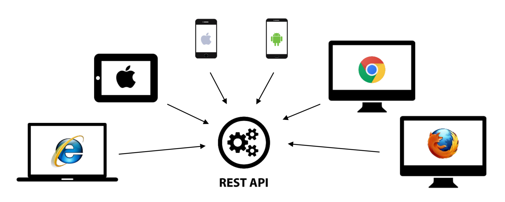

해당 게시물은 [ 부스트코스 ] - 웹프로그래밍 강의( REST API )를 기반으로 합니다. 

### Summary
 - API란?
 - REST API란?

### What is API ( Application Programming Interface )

 이번 포스팅에서는 다소 이론적인 이야기를 해보려 합니다.

 근래 많은 웹, 앱 어플리케이션에서 API라는 개념을 이용하고 있습니다.
 
 API 에 대해서 말하기 이전에 interface에 대해서 알아보도록 하겠습니다.

 interface란 기능을 구현하지 않고 기능에 대한 개념 또는 추상적 의미를 미리 정의해 두는 것입니다.

 interface가 존재하지 않는다면 어떤 문제가 생길까요??

 다양한 환경으로 나뉘어 각각 개발될 때 특정 인터페이스가 없다면, 차후에 이를 유지 보수하는 작업은 매우 힘들 것입니다.

 이에 따라 변수, 함수 명을 지정하고 이를 상속 또는 구현을 통해서 코드의 재사용성과 간결성을 유지할 수 있습니다.

 다시 돌아와서 API는 무엇있까요?

 클라이언트의 종류가 웹 브라우저, 안드로이드 앱, iOS 앱 등 다양해지면서 이러한 클라이언트들에게 정보를 제공하는 방식을 하나로 일원화할 필요성이 생겼습니다.

 일원화시키는 방식 중에 대표적인 방식이 HTTP프로토콜로 API를 제공하는 것입니다.

 이러한 API Server을 만들게 된다면, 각 어플리케이션을 위한 함수 또는 서버를 만들 필요성이 없어지며 이것은 매우 큰 장점이 됩니다.

 정리하자면, API란

 - 서로 공통된 기능을 추상적으로 묶어 관리하는 것 

 - 이러한 API을 제공하는 방법을 일원화 시킴으로써 개발과 관리에 편리성을 제공하는 것

 으로 정리할 수 있을 것 같습니다.

 

### What is REST API ( Application Programming Interface ) 
 
언제나 One more thing이 존재하죠 REST란 개념은 무엇일까여?

간단하게는, REST형태를 지닌 API를 의미합니다. 무엇을 REST하다고 설명할까요?
 
1. client-server

2. stateless

3. cache

4. uniform interface

5. layered system

6. code-on-demand (optional )

의 특징을 지녀야 RESTful 하다고 말할 수 있습니다.

여기서 client-server, stateless, cache, layered system ... 이 특징은 어디서 많이 보았죠?

바로 HTTP의 특징입니다. HTTP을 사용함으로써 REST의 특정 요건을 맞출 수 있습니다.

여기서 uniform interface을 위한 정책을 수립하면 우리가 원하는 REST의 형태를 만들 수 있습니다.

이러한 문제를 해결하기 위해서 HTTP에 필수적인 URL의 형태를 제약함으로써 이 특징마저 충졷할 수 있습니다.

어떠한 규칙을 추가할까요? 

다들 HTTP에 method가 존재한다는 점은 알고 계실겁니다. 하지만 이 method에 대응되는 기능은 개발을 하는 개발자의 선택에 따라 자유롭게 변경이 됩니다.

이러한 자유성을 규칙을 통해서 획일화된 체계를 구축합니다.  그 방식을 아래와 같습니다.

 - 리소스가 URI로 식별되야 합니다.
  ex) https:// ... /members/1 ( 1로 구분이 되며 특정 회원을 구분할 수 있어야 함 )

 - 리소스를 생성,수정,추가하고자 할 때 HTTP메시지에 표현을 해서 전송해야 합니다.
  가장 중요한 기능 CRUD 기능을 method와 1:1 매칭합니다.
  [ create : post, read : get, update : put, delete : delete]

 - 메시지는 스스로 설명할 수 있어야 합니다. (Self-descriptive message)

 - 애플리케이션의 상태는 Hyperlink를 이용해 전이되야 합니다.(HATEOAS)

 등의 특징을 만족해야 API이며 RESTful 하다고 할 수 있습니다.

 특정 기능들을 추상화하여 묶어 정리하며 이 기능을 REST 형태를 맞추어 HTTP 통신을 한다는 점은 매우 까다롭지만 매우 매력이 있는 방법입니다.

ㅌ
 API SERVER와 이전 POST에서의 token은 분리가 불가능한 개념이죠?

 이에 대해서는 다음 포스팅에서 더 자세히 다루어 보도록 하겠습니다.

#### image
 - boostCourse-24.png : [ [부스트코스] 웹 프로그래밍 ]( https://www.edwith.org/boostcourse-web/lecture/16740/)

#### 추가 정보
 - MDN web docs : [Object.create()](https://developer.mozilla.org/ko/docs/Web/JavaScript/Reference/Global_Objects/Object/create)

해당 게시물은 [ 부스트코스 ] - 웹프로그래밍 강의( 상태정보 )를 기반으로 하얐습니다. 
더 자세한 내용에 대해서 알고 싶으시다면, 아래에 안내되는 페이지에서 확인할 수 있습니다.

부스트코스 메인 페이지 : https://www.edwith.org/boostcourse-web
이번 포스트와 관련된 페이지 : https://www.edwith.org/boostcourse-web/lecture/16740/ 

